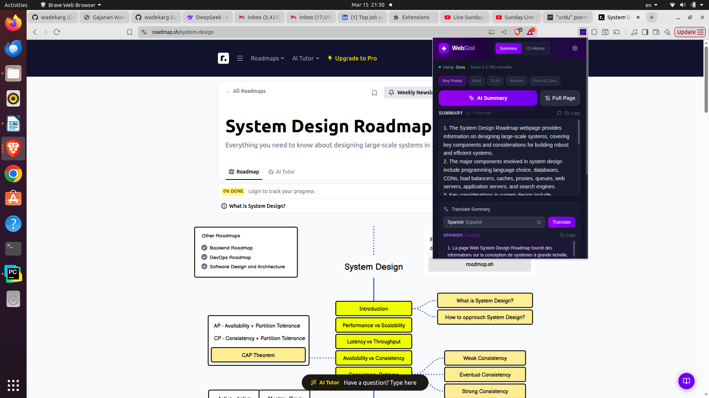
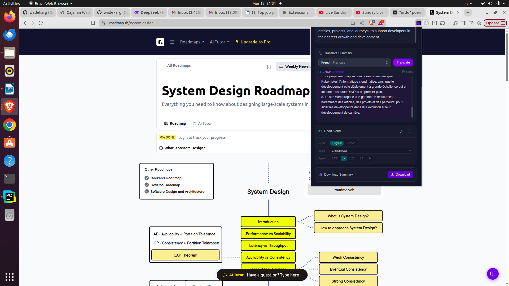
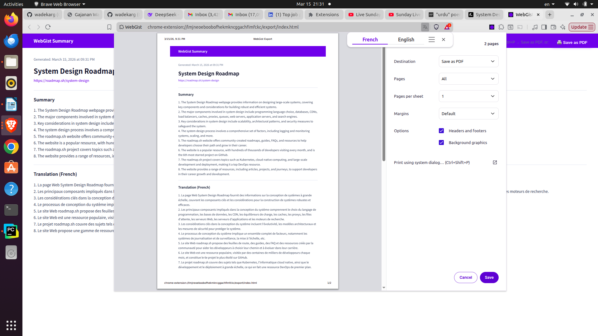

# WebGist — AI Webpage Summarizer for Chrome

WebGist is a Chrome extension that summarizes any webpage using your choice of AI provider. It also translates summaries into 84 languages, reads them aloud with text-to-speech, exports them to PDF, and saves them to a searchable history — all without sending your data to any third-party service beyond the AI provider you choose.

---

## Screenshots

### AI Summary + Floating Button


### Translation + Read Aloud + Export


### PDF Export


---

## Features

| Feature | Details |
|---------|---------|
| **AI Summary** | 5 modes: Key Points, Brief, ELI5, Actions, Pros & Cons |
| **Full Page** | Extract the full clean article text — no API key needed |
| **Translation** | 84 languages via Google Translate, no API key needed |
| **Read Aloud** | Text-to-speech for original or translated text, 5 speed levels |
| **PDF Export** | Download a formatted PDF of the summary and translation |
| **History** | Save and revisit up to 50 summaries |
| **7 AI Providers** | Gemini, Groq, Mistral, Cohere, OpenRouter, Anthropic, Cerebras |
| **Session Cache** | Summary survives popup close/reopen within the same tab |
| **Floating Button** | Draggable button on every page — click to open WebGist instantly |

---

## Supported AI Providers

All providers offer a **free tier** — no credit card required to get started.

| Provider | Default Model | Free Tier |
|----------|--------------|-----------|
| **Google Gemini** | gemini-2.0-flash | 15 requests/min, 1M tokens/day |
| **Groq** | llama-3.3-70b-versatile | 30 requests/min, ultra-fast |
| **Mistral** | mistral-small-latest | 1 request/sec |
| **Cohere** | command-r | 20 requests/min (trial key) |
| **OpenRouter** | llama-3.3-70b-instruct:free | Multiple free models |
| **Anthropic** | claude-haiku-4-5 | Limited free tier |
| **Cerebras** | llama-3.3-70b | Free tier, extremely fast inference |

---

## Installation

WebGist is not yet on the Chrome Web Store. Load it manually in developer mode:

1. **Download or clone this repository**
   ```bash
   git clone https://github.com/wadekarg/WebGist.git
   cd webgist
   ```

2. **Install dependencies and build**
   ```bash
   npm install
   npm run build
   ```
   This creates a `dist/` folder — that is the extension.

3. **Load into Chrome**
   - Open Chrome and go to `chrome://extensions`
   - Enable **Developer mode** (toggle in the top-right corner)
   - Click **Load unpacked**
   - Select the `dist/` folder inside the project

4. The WebGist icon appears in your toolbar. Pin it for easy access.

---

## Setup

### 1. Get a free API key

Open the WebGist popup → click the **Settings** tab → click **"Get free API key"** next to your chosen provider.

Recommended for beginners: **Google Gemini** — the free tier is generous and setup takes under a minute at [aistudio.google.com](https://aistudio.google.com/app/apikey).

### 2. Configure WebGist

1. Open WebGist → **Settings** tab
2. Select your **Provider** from the dropdown
3. Select the **Model** (default is already the best free option)
4. Paste your **API key**
5. Click **Save Settings**

Your API key is stored locally in Chrome's sync storage and never sent anywhere except the provider's official API endpoint.

---

## How to Use

### AI Summary

1. Navigate to any webpage
2. Click the WebGist icon (or the floating button on the page)
3. Select a summary mode:
   - **Key Points** — 6–8 numbered bullet points
   - **Brief** — 3–4 sentence overview
   - **ELI5** — Simple plain-language explanation
   - **Actions** — Actionable takeaways starting with verbs
   - **Pros & Cons** — Structured pros and cons list
4. Click **AI Summary**

> Requires an API key to be configured in Settings.

### Full Page

Click **Full Page** to extract and display the clean article text without any AI processing. Useful for reading distraction-free or for pages where you just want the raw content. **No API key required.**

The extraction uses a three-tier pipeline for best quality:
1. **Trafilatura** (local server, optional — highest accuracy)
2. **Jina AI Reader** (free, server-side rendering)
3. **Readability** (Mozilla's article extractor, always available)

### Translate Summary

After generating a summary:
1. The **Translate Summary** panel appears below the summary
2. Select a language from the dropdown (supports 84 languages, searchable by name or native script)
3. Click **Translate**

The translated text appears immediately below. Both the original and translated summaries are saved together.

### Read Aloud

After generating a summary:
1. The **Read Aloud** panel appears
2. Click the **Play** button
3. If a translation exists, toggle between **Original** and the translated language using the pill selector
4. Adjust the **Voice** (uses your system's installed voices; falls back to Google TTS automatically)
5. Adjust the **Speed** — 0.75× to 2×

TTS works even when the popup is closed. It uses a two-tier system:
- **Tier 1:** Web Speech API (native system voices)
- **Tier 2:** Google Translate TTS (automatic fallback — works without any TTS engine installed)

### Export to PDF

After generating a summary:
1. Click **Download** in the Export panel
2. A print-ready page opens in a new tab with your summary (and translation if available) formatted cleanly
3. Your browser's print dialog opens — choose **"Save as PDF"**

The PDF includes the page title, URL, generation date, summary, and translation (if any).

### History

- Click the **bookmark icon** in the summary panel to save the current summary
- Open the **History** tab to see all saved summaries (up to 50)
- Click any entry to expand a preview
- Click **Load summary** to restore it to the main view
- Click **Open page** to re-open the original webpage in a background tab
- Individual entries can be deleted, or use **Clear all** to reset

---

## Optional: Trafilatura Local Server (Best Extraction Quality)

For the highest-quality text extraction — especially useful for news articles, blogs, and content-heavy pages — you can run the optional local extraction server:

### Setup

```bash
pip install trafilatura fastapi uvicorn
python webgist_server.py
```

The server runs on `http://127.0.0.1:7777`. Keep this terminal open while using WebGist.

### How it works

When the server is running, WebGist automatically uses it as the first extraction step before Jina or Readability. Trafilatura achieves the highest content extraction accuracy of any open-source tool (F1 score ~0.96 on standard benchmarks).

When the server is **not** running, WebGist falls back to Jina AI Reader and Readability seamlessly — no configuration needed.

---

## Floating Action Button

A draggable **WebGist button** is injected into every webpage. Click it to open the WebGist popup without needing to go to the toolbar.

- **Drag** to reposition it anywhere on the screen
- Its position is saved per-browser-profile via `localStorage`
- It sits at maximum z-index so it stays above all page content

---

## Privacy

WebGist is designed with privacy first:

- **No analytics or tracking** — zero telemetry, no usage data collected
- **API keys stored locally** — in Chrome's own storage, never on any external server
- **Page content stays local** — content is only sent to the AI provider you configured, and only when you click "AI Summary"
- **Full Page and translation** — these use Jina AI and Google Translate respectively; only the text content (not your identity or browsing history) is sent
- **History stored locally** — in Chrome's local storage on your device only

See [PRIVACY_POLICY.md](PRIVACY_POLICY.md) for the full policy.

---

## Project Structure

```
src/
├── popup/              # React UI (popup window)
│   ├── App.tsx         # Main application state and logic
│   └── components/     # Header, SummaryPanel, TranslationPanel,
│                       # AudioControls, ExportPanel, HistoryPanel,
│                       # ProviderSettings
├── background/
│   └── service-worker.ts   # AI API relay, enhanced extraction, TTS relay
├── content/
│   └── index.ts        # Page text extraction + floating action button
├── offscreen/
│   └── tts.ts          # Text-to-speech (runs when popup is closed)
├── export/
│   └── index.ts        # PDF relay page
└── utils/
    ├── providers.ts    # AI provider API implementations (7 providers)
    ├── storage.ts      # Chrome storage abstraction (sync/local/session)
    ├── googleTranslate.ts  # Translation via Google Translate
    └── pdf.ts          # PDF generation

webgist_server.py       # Optional local extraction server (Trafilatura)
```

---

## Tech Stack

- **React 18** + TypeScript — popup UI
- **Tailwind CSS** — styling
- **Vite** — build system
- **@mozilla/readability** — article extraction fallback
- **Trafilatura** (Python, optional) — best-in-class content extraction
- **Web Speech API** — native text-to-speech
- **Google Translate TTS** — TTS fallback (free, no key)
- **Chrome Manifest V3** — extension platform

---

## Building from Source

```bash
npm install       # install dependencies
npm run build     # production build → dist/
npm run dev       # watch mode for development
```

After each build, go to `chrome://extensions` → click the **reload** button on the WebGist card to apply changes.

---

## License

MIT — see [LICENSE](LICENSE) for details.
